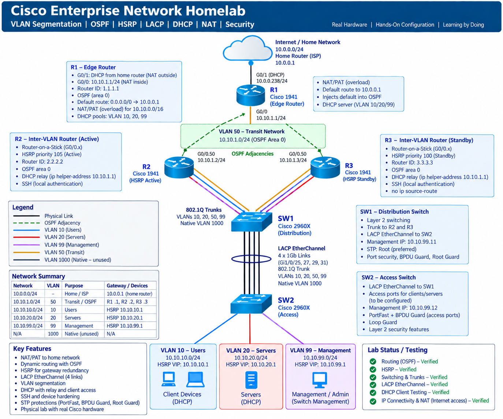

# Cisco Enterprise Network Homelab

A hands-on physical Cisco networking lab designed to simulate a small enterprise network using routing, switching, redundancy, segmentation, network services, security, and troubleshooting.

The goal of this project was to move beyond simulations and configure real Cisco routers and switches while practicing enterprise networking concepts including OSPF, HSRP, VLANs, LACP EtherChannel, DHCP, NAT/PAT, SSH, and Layer 2 security.

## Physical Hardware

- 3 Cisco routers: R1, R2, R3
- 2 Cisco switches: SW1, SW2
- Physical Ethernet cabling and terminations
- Client devices for connectivity testing

## Technologies & Protocols

- IPv4 addressing and subnetting
- VLAN segmentation
- IEEE 802.1Q trunking
- Router-on-a-Stick
- OSPF
- HSRP
- LACP EtherChannel
- DHCP
- DHCP Relay
- NAT/PAT
- SSH
- Spanning Tree Protocol
- PortFast
- BPDU Guard
- Network Security / ACLs

## Network Architecture



The lab separates the home/ISP network from the private enterprise lab.

R1 operates as the edge router and connects the lab to the upstream home network. It provides NAT overload, DHCP services, and advertises the default route into OSPF.

R2 and R3 provide redundant inter-VLAN routing using router-on-a-stick and HSRP.

SW1 operates as the distribution switch while SW2 provides access-layer connectivity.

### Network Segments

| Network | VLAN | Purpose | Gateway |
|---|---:|---|---|
| 10.0.0.0/24 | — | Home / upstream network | 10.0.0.1 |
| 10.10.1.0/24 | 50 | Router transit / OSPF | R1 `.1`, R2 `.2`, R3 `.3` |
| 10.10.10.0/24 | 10 | Users | HSRP VIP `10.10.10.1` |
| 10.10.20.0/24 | 20 | Servers | HSRP VIP `10.10.20.1` |
| 10.10.99.0/24 | 99 | Network management | HSRP VIP `10.10.99.1` |
| — | 1000 | Native / unused trunk VLAN | — |

## Routing – OSPF

OSPF provides dynamic routing between R1, R2, and R3.

Router IDs:

- R1: `1.1.1.1`
- R2: `2.2.2.2`
- R3: `3.3.3.3`

The routers form OSPF adjacencies across VLAN 50 (`10.10.1.0/24`).

R1 provides the lab's default route toward the upstream home router and originates the default route into OSPF.

## First-Hop Redundancy – HSRP

R2 and R3 provide redundant default gateways for the internal VLANs.

R2 operates as the active HSRP router while R3 operates as standby.

### Virtual Gateways

- VLAN 10 → `10.10.10.1`
- VLAN 20 → `10.10.20.1`
- VLAN 99 → `10.10.99.1`

If the active gateway becomes unavailable, HSRP allows the standby router to provide gateway redundancy.

## Switching & EtherChannel

SW1 and SW2 are connected using a four-link LACP EtherChannel.

Member interfaces:

- Gi1/0/25
- Gi1/0/27
- Gi1/0/29
- Gi1/0/31

The resulting `Port-channel1` operates as an 802.1Q trunk carrying:

- VLAN 10
- VLAN 20
- VLAN 50
- VLAN 99

VLAN 1000 is configured as the native VLAN.

## DHCP

R1 provides DHCP services for the internal VLANs.

DHCP pools exist for:

- Users – VLAN 10
- Servers – VLAN 20
- Management – VLAN 99

R2 and R3 use `ip helper-address` to relay DHCP requests from the client VLANs to R1.

## Internet Connectivity & NAT

R1 acts as the network edge.

The internal `10.10.0.0/16` network is translated using NAT overload/PAT through R1's upstream interface.

This allows multiple internal devices to share the upstream address when accessing external networks.

## Network Security & Management

The lab includes several network hardening and management features:

- SSH-only remote CLI access
- Local authentication
- PortFast on appropriate access ports
- BPDU Guard
- Dedicated management VLAN
- Non-user native VLAN
- Passive OSPF interfaces
- Network segmentation using VLANs

## Verification

The environment was validated using Cisco IOS commands including:

```text
show ip interface brief
show ip route
show ip ospf neighbor
show standby brief
show ip nat translations
show ip dhcp binding
show vlan brief
show interfaces trunk
show etherchannel summary
show spanning-tree
