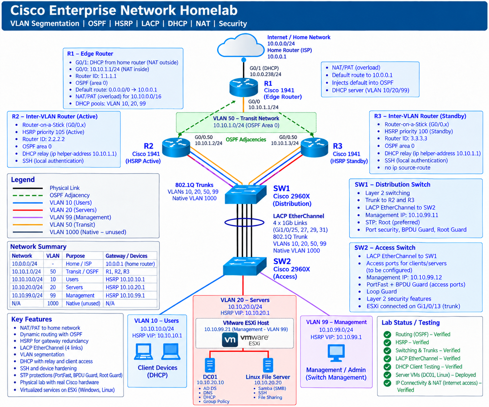

# Cisco Enterprise Network Homelab

A hands-on enterprise-style homelab combining **physical Cisco networking, VMware virtualization, Windows Server infrastructure, and Linux services**.

The project was built to gain practical experience designing, configuring, testing, and troubleshooting an environment that integrates physical network infrastructure with virtualized servers and clients.

## 🏗️ Network Topology



## 📚 Project Documentation

- [VMware ESXi & Virtualization](documentation/vmware-esxi.md)
- [Active Directory & Windows Server](documentation/active-directory.md)
- [Linux File Server](documentation/linux-file-server.md)
- [Remote Access](documentation/remote-access.md)
- [Network Verification & Testing](documentation/verification.md)
- [Troubleshooting & Deployment Challenges](documentation/troubleshooting.md)
- [Future Homelab Implementations](documentation/future-implementations.md)

## 🔧 Core Technologies

`Cisco IOS` `VLANs` `802.1Q` `OSPF` `HSRP` `LACP` `EtherChannel` `DHCP` `NAT/PAT` `ACLs` `SSH` `STP` `VMware ESXi` `Windows Server` `Active Directory` `DNS` `Group Policy` `Ubuntu Server` `Samba`

---

## 🖥️ Virtualization & Server Infrastructure

The physical Cisco network is integrated with a **VMware ESXi** virtualization host connected to **SW2 Gi1/0/13**.

The ESXi environment extends the physical VLAN architecture into the virtual infrastructure, allowing virtual servers and clients to operate on the same segmented enterprise network.

| System | Role | Network | IP Address |
|---|---|---|---|
| VMware ESXi Host | Virtualization platform | VLAN 99 - Management | `10.10.99.21` |
| DC01 | Active Directory / DNS | VLAN 20 - Servers | `10.10.20.10` |
| Linux File Server | Samba / SSH | VLAN 20 - Servers | `10.10.20.20` |
| Windows 11 Client | Domain-joined workstation | VLAN 10 - Users | DHCP |

The ESXi host provides separate virtual networks for:

- **Management Network** → VLAN 99
- **Servers-VLAN20** → VLAN 20
- **Users-VLAN10** → VLAN 10

Implemented server and virtualization services include:

- VMware ESXi virtualization
- Windows Server
- Active Directory Domain Services
- DNS
- Group Policy
- Domain authentication
- Ubuntu Server
- Samba file sharing
- SSH administration

---

## 🌐 Network Architecture

The lab separates the home/upstream network from the internal enterprise environment.

**R1** operates as the edge router and connects the lab to the upstream home network. It provides NAT overload, DHCP services, and advertises the default route into OSPF.

**R2 and R3** provide redundant inter-VLAN routing using Router-on-a-Stick and HSRP.

**SW1** operates as the distribution switch while **SW2** provides access-layer connectivity and connectivity to the VMware ESXi environment.

### Network Segments

| Network | VLAN | Purpose | Gateway |
|---|---:|---|---|
| `10.0.0.0/24` | — | Home / upstream network | `10.0.0.1` |
| `10.10.1.0/24` | 50 | Router transit / OSPF | R1 `.1`, R2 `.2`, R3 `.3` |
| `10.10.10.0/24` | 10 | Users | HSRP VIP `10.10.10.1` |
| `10.10.20.0/24` | 20 | Servers | HSRP VIP `10.10.20.1` |
| `10.10.99.0/24` | 99 | Network management | HSRP VIP `10.10.99.1` |
| — | 1000 | Native / unused trunk VLAN | — |

---

## 🔀 Routing – OSPF

OSPF provides dynamic routing between R1, R2, and R3.

Router IDs:

- R1: `1.1.1.1`
- R2: `2.2.2.2`
- R3: `3.3.3.3`

The routers form OSPF adjacencies across VLAN 50 (`10.10.1.0/24`).

R1 provides the lab's default route toward the upstream home router and originates the default route into OSPF.

---

## ♻️ First-Hop Redundancy – HSRP

R2 and R3 provide redundant default gateways for the internal VLANs.

R2 operates as the active HSRP router while R3 operates as standby.

### Virtual Gateways

- VLAN 10 → `10.10.10.1`
- VLAN 20 → `10.10.20.1`
- VLAN 99 → `10.10.99.1`

If the active gateway becomes unavailable, HSRP allows the standby router to assume the gateway role.

---

## 🔗 Switching & EtherChannel

SW1 and SW2 are connected using a four-link **LACP EtherChannel**.

Member interfaces:

- Gi1/0/25
- Gi1/0/27
- Gi1/0/29
- Gi1/0/31

The resulting `Port-channel1` operates as an 802.1Q trunk carrying:

- VLAN 10
- VLAN 20
- VLAN 50
- VLAN 99

VLAN 1000 is configured as the native VLAN.

---

## 📡 DHCP

R1 provides DHCP services for the internal VLANs.

DHCP pools exist for:

- Users – VLAN 10
- Servers – VLAN 20
- Management – VLAN 99

R2 and R3 use `ip helper-address` to relay DHCP requests from the client VLANs to R1.

The Windows 11 domain client on VLAN 10 receives its network configuration through this DHCP infrastructure.

---

## 🌍 Internet Connectivity & NAT

R1 acts as the network edge.

The internal `10.10.0.0/16` network is translated using **NAT overload/PAT** through R1's upstream interface.

This allows multiple internal devices and virtual machines to share the upstream address when accessing external networks.

---

## 🔐 Network Security & Management

The lab includes several network hardening and management features:

- SSH-only remote CLI access
- Local authentication
- PortFast on appropriate access ports
- BPDU Guard
- Root Guard
- Loop Guard
- Dedicated management VLAN
- Non-user native VLAN
- Passive OSPF interfaces
- VLAN-based network segmentation
- DHCP snooping
- Access control using ACLs

---

## 🪟 Windows Server & Active Directory

A Windows Server virtual machine named **DC01** provides centralized identity and DNS services.

- Hostname: `DC01`
- IP: `10.10.20.10`
- VLAN: 20 - Servers
- Domain: `ad.homelab.com`
- Roles: Active Directory Domain Services and DNS

The environment includes departmental Organizational Units, security groups, domain users, Group Policy, and a Windows 11 domain client.

A Group Policy Object is used to apply settings to HR users, including workstation restrictions and automatic mapping of the HR network share.

📄 [View Active Directory & Windows Server Documentation](documentation/active-directory.md)

---

## 🐧 Linux File Server

An Ubuntu Server VM operates on the server network at:

`10.10.20.20`

The Linux server provides:

- SSH remote administration
- Samba file sharing
- Linux user/group permissions
- Shared storage accessible from Windows clients
- Integration with the existing VLAN and DNS infrastructure

A Samba share named **CompanyShare** was configured and tested from Windows.

📄 [View Linux File Server Documentation](documentation/linux-file-server.md)

---

## 🔒 Remote Lab Access

Secure remote connectivity was implemented using **Tailscale**.

The Linux server can provide access to the internal server subnet without exposing ESXi, SSH, or other management services directly to the public Internet.

This allows remote connectivity to internal lab resources while maintaining the existing private addressing scheme.

📄 [View Remote Access Documentation](documentation/remote-access.md)

---

## 🧪 Verification

The Cisco network was validated using IOS commands including:

```text
show ip interface brief
show ip route
show ip ospf neighbor
show standby brief
show ip nat translations
show ip dhcp binding
show vlan brief
show interfaces trunk
show etherchannel summary
show spanning-tree
```

Additional end-to-end testing included:

- DHCP address assignment
- Inter-VLAN connectivity
- Internet connectivity through NAT/PAT
- OSPF neighbor formation
- HSRP gateway redundancy
- LACP EtherChannel operation
- ESXi management connectivity
- Virtual machine VLAN connectivity
- DNS resolution
- Active Directory domain authentication
- Group Policy application
- Windows-to-Linux Samba file sharing
- SSH connectivity

📄 [View Network Verification & Testing](documentation/verification.md)

---

## 🛠️ Troubleshooting Experience

Building the environment required troubleshooting real configuration and Layer 1 issues.

Examples include:

- Incorrect DNS configuration in a DHCP pool
- EtherChannel connectivity issues caused by cable termination
- Ethernet link negotiating at 100 Mbps due to cabling
- ACL placement blocking ICMP/DNS testing
- SSH compatibility issues between modern OpenSSH clients and older Cisco IOS devices
- Virtual machine storage allocation and thin provisioning
- DNS configuration for Active Directory clients
- VLAN connectivity between physical and virtual infrastructure

These issues were documented along with their symptoms, troubleshooting process, root cause, and resolution.

📄 [View Troubleshooting & Deployment Challenges](documentation/troubleshooting.md)

---

## 🎯 Skills Practiced

This project provided hands-on experience with:

- Enterprise network design
- Cisco router and switch configuration
- VLAN segmentation
- Dynamic routing
- Gateway redundancy
- Link aggregation
- DHCP and DHCP relay
- NAT/PAT
- Network security
- Layer 1 troubleshooting
- VMware ESXi virtualization
- Virtual networking
- Windows Server administration
- Active Directory
- DNS
- Group Policy
- Linux administration
- Samba file sharing
- SSH
- Cross-platform troubleshooting
- Network and server integration

---

## 🚀 Future Improvements

Future additions to the homelab may include:

- Expanded VMware virtualization
- Additional Windows and Linux servers
- Centralized monitoring and logging
- Backup and recovery testing
- Additional network security controls
- Expanded remote administration
- Infrastructure automation

📄 [View Future Homelab Implementations](documentation/future-implementations.md)
