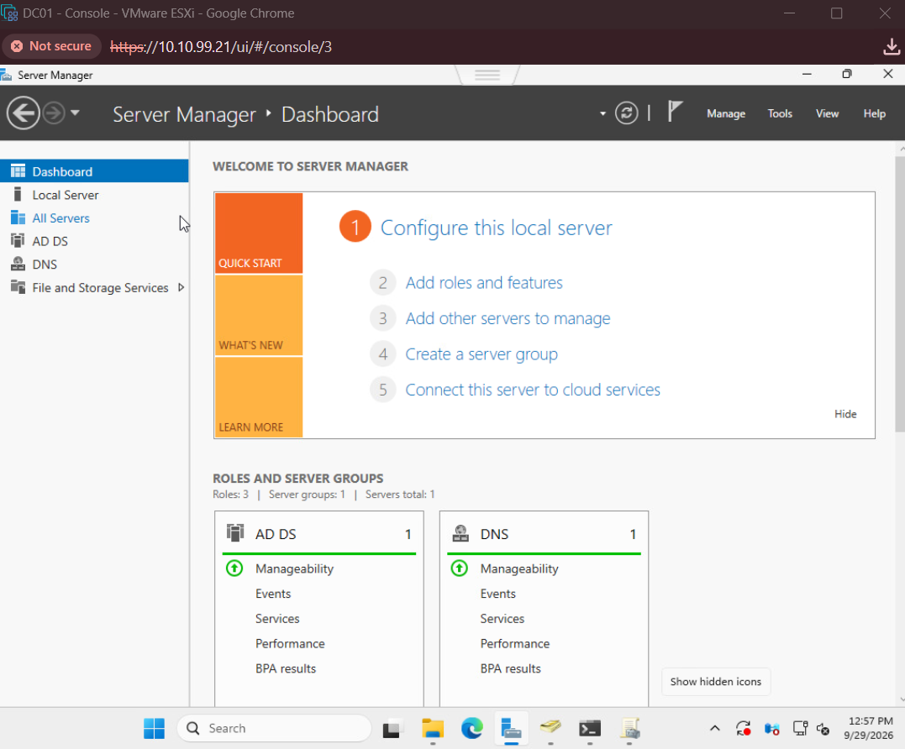
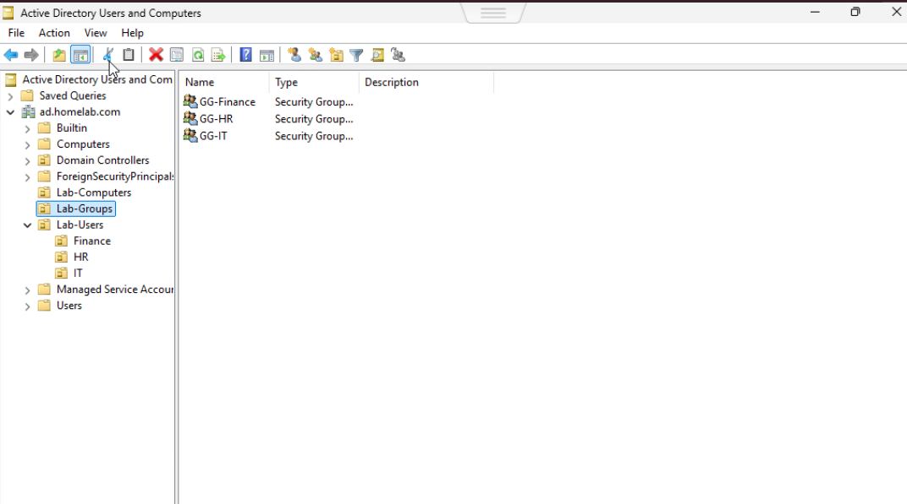
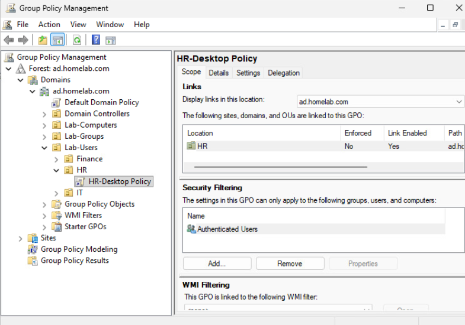
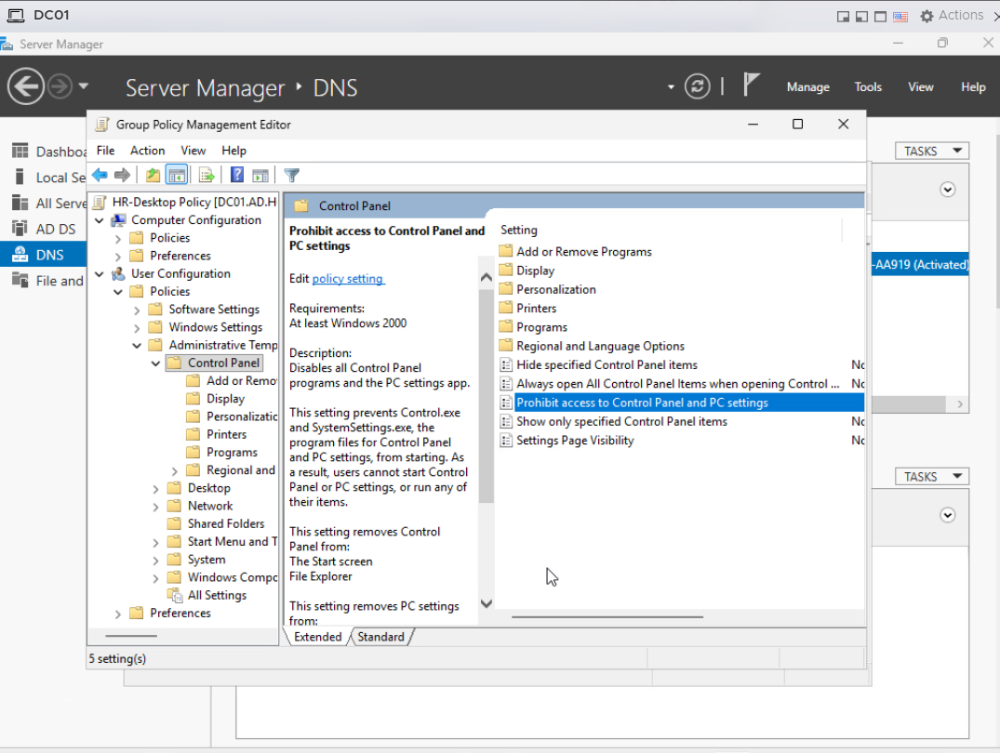
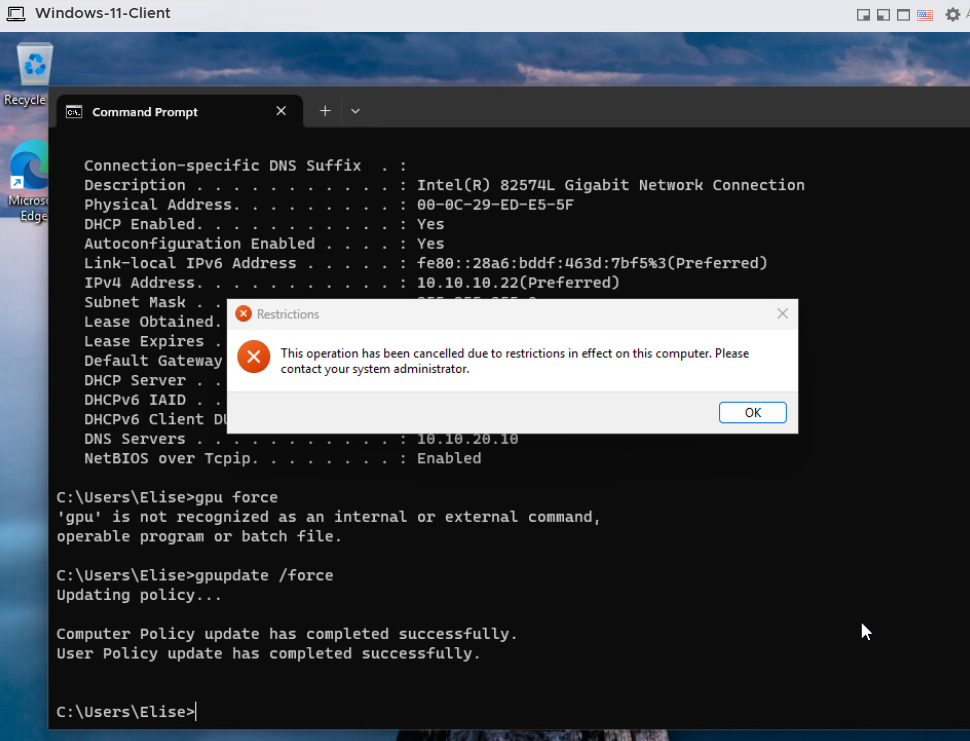
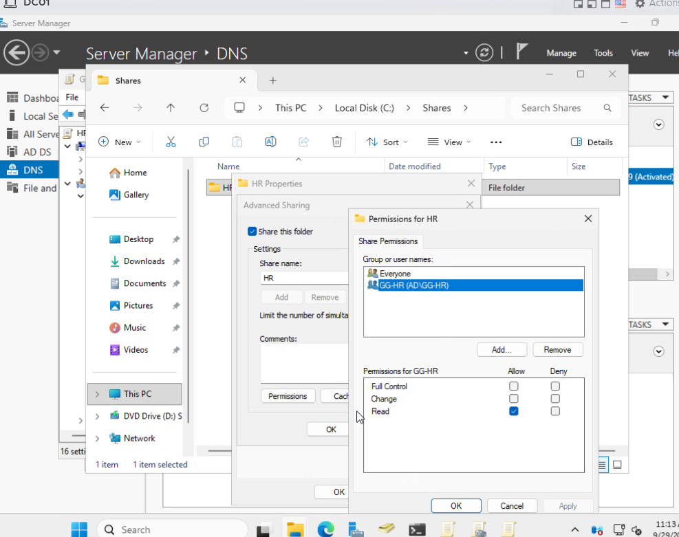
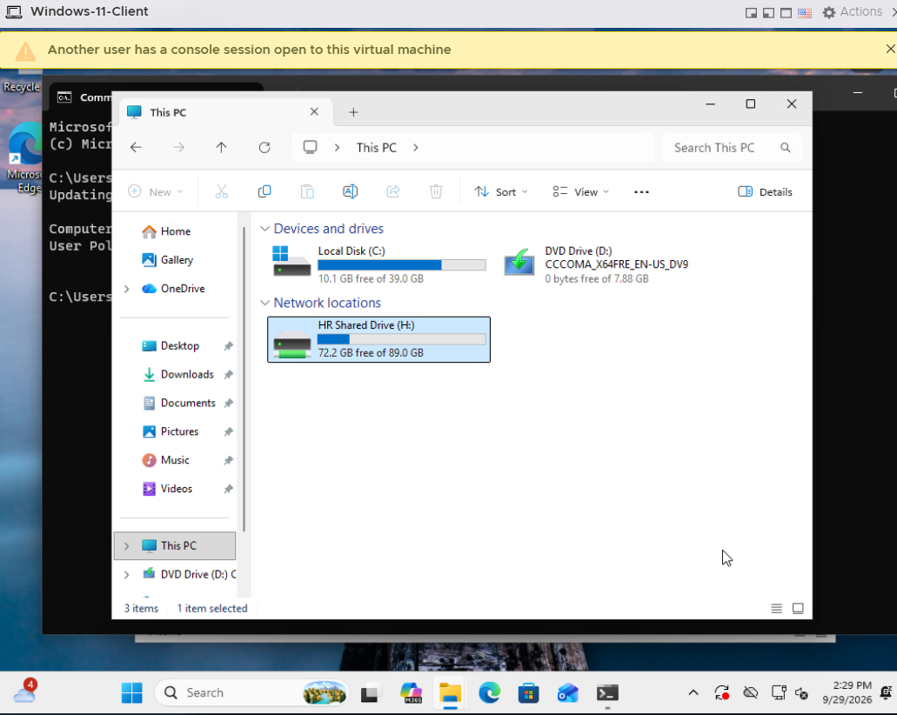

# Windows Server, Active Directory & Group Policy

## Overview

A Windows Server virtual machine named **DC01** was deployed on VMware ESXi to provide centralized identity, authentication, DNS, Group Policy, and departmental resource management for the homelab.

The environment simulates a small enterprise Active Directory deployment where users and computers are centrally managed and policies are applied based on organizational structure.

---

## DC01 Configuration

| Setting | Configuration |
|---|---|
| Hostname | `DC01` |
| Network | `Servers-VLAN20` |
| VLAN | 20 |
| IP Address | `10.10.20.10` |
| Default Gateway | `10.10.20.1` |
| Domain | `ad.homelab.com` |
| Roles | Active Directory Domain Services (AD DS), DNS |

DC01 operates on the dedicated server VLAN and provides domain and DNS services to domain-connected systems.

### Windows Server Roles



Active Directory Domain Services and DNS were installed on DC01. DNS integration allows domain clients to locate Active Directory services while DC01 can also resolve external DNS queries.

---

## Active Directory Structure

The Active Directory environment was organized using Organizational Units (OUs) to simulate departmental administration.

The following structure was created:

```text
ad.homelab.com
│
├── Lab-Computers
│
├── Lab-Groups
│   ├── GG-Finance
│   ├── GG-HR
│   └── GG-IT
│
└── Lab-Users
    ├── Finance
    ├── HR
    └── IT
```

Departmental security groups were created to manage access to resources:

- `GG-Finance`
- `GG-HR`
- `GG-IT`

### OU and Security Group Structure



This structure separates users, computers, and security groups while allowing policies and permissions to be assigned based on department.

---

## Windows 11 Domain Client

A Windows 11 Pro virtual machine was deployed on **VLAN 10 - Users** to represent an employee workstation.

| Setting | Configuration |
|---|---|
| Operating System | Windows 11 Pro |
| Network | `Users-VLAN10` |
| VLAN | 10 |
| Addressing | DHCP |
| Default Gateway | `10.10.10.1` |
| DNS Server | `10.10.20.10` |
| Domain | `ad.homelab.com` |

The workstation successfully joined the `ad.homelab.com` domain.

This also validates communication between the user VLAN and server VLAN because the Windows 11 client must communicate across the physical Cisco network with DC01 on VLAN 20.

---

## Group Policy

A Group Policy Object named **HR-Desktop Policy** was created to manage users in the HR Organizational Unit.

The GPO was linked specifically to the **HR OU**.

### GPO Link



Linking the GPO to the HR OU allows HR users to receive department-specific configurations without applying the same settings to Finance or IT users.

---

## Control Panel Restriction

One of the HR policies prevents users from accessing **Control Panel and PC Settings**.

### Policy Configuration



This demonstrates how Group Policy can centrally restrict workstation settings without manually configuring each computer.

---

## Group Policy Client Verification

The policy was tested using the HR domain user **Elise** on the Windows 11 client.

Group Policy was refreshed using:

```text
gpupdate /force
```

Both computer and user policy updates completed successfully.

An attempt to access a restricted Windows setting was then blocked by the configured policy.

### Client-Side Verification



This verifies the complete policy path:

```text
DC01
  |
  v
Active Directory
  |
  v
HR Organizational Unit
  |
  v
HR-Desktop Policy
  |
  v
HR Domain User
  |
  v
Windows 11 Client
```

---

## HR Shared Folder

A departmental file share was created on DC01:

```text
C:\Shares\HR
```

The folder was shared on the network as:

```text
\\DC01\HR
```

Access is controlled using the `GG-HR` Active Directory security group.

### Share Permissions



Using an Active Directory group instead of assigning permissions directly to individual users makes access easier to manage as users join or leave a department.

Users can be added to or removed from `GG-HR`, and access to the departmental resource can be managed through group membership.

---

## Group Policy Drive Mapping

The **HR-Desktop Policy** was also used to automatically map the departmental share for HR users.

The share:

```text
\\DC01\HR
```

is mapped to:

```text
H:
```

and appears as:

```text
HR Shared Drive
```

### Client Verification



This demonstrates how Group Policy Preferences can automatically provide users with departmental resources after domain authentication.

Instead of manually mapping the drive on every workstation, the configuration is centrally managed through Active Directory.

---

## DNS Integration

Active Directory relies heavily on DNS for locating domain controllers and domain services.

DC01 operates as the DNS server for the Active Directory environment.

Domain clients use:

```text
10.10.20.10
```

as their DNS server.

Testing confirmed resolution of the internal domain:

```text
ad.homelab.com
```

as well as external DNS names.

This allows domain clients to locate DC01 while maintaining normal external name resolution.

---

## Cross-VLAN Active Directory Communication

The Windows 11 workstation and DC01 reside on different VLANs:

```text
Windows 11 Client
VLAN 10 - Users
10.10.10.x
        |
        v
   ESXi vSwitch
        |
        v
       SW2
        |
        v
    Cisco Network
        |
        v
     R2 / R3
 Inter-VLAN Routing
        |
        v
VLAN 20 - Servers
        |
        v
      DC01
  10.10.20.10
```

The client can communicate with the domain controller because R2 and R3 provide inter-VLAN routing between the user and server networks.

This integrates the Windows Server environment directly with the routing and switching portion of the homelab.

---

## Validation

The Active Directory environment was validated by testing:

- Active Directory Domain Services operation
- DNS resolution
- Windows 11 domain join
- Domain user authentication
- Organizational Unit structure
- Security group creation
- Group Policy linking
- Group Policy updates with `gpupdate /force`
- Control Panel restriction
- Departmental file-share access
- Group-based permissions
- Automatic drive mapping
- Communication between VLAN 10 and VLAN 20

---

## Skills Practiced

This portion of the project provided hands-on experience with:

- Windows Server administration
- Active Directory Domain Services
- Domain Controller deployment
- DNS administration
- Active Directory users and groups
- Organizational Units
- Security groups
- Group Policy Objects
- Group Policy Preferences
- Windows domain joins
- User authentication
- Windows file sharing
- Share and NTFS permissions
- Drive mapping
- Cross-VLAN client/server communication
- Enterprise-style centralized administration

---

## Key Takeaway

The Active Directory portion of the homelab demonstrates how network infrastructure and Windows systems administration work together.

The Windows 11 workstation resides on the user VLAN while DC01 resides on the server VLAN. The physical Cisco network provides connectivity between these systems, while Active Directory provides centralized authentication, DNS, policy enforcement, and access to departmental resources.

This creates a more realistic enterprise environment than testing Active Directory on an isolated virtual network.
