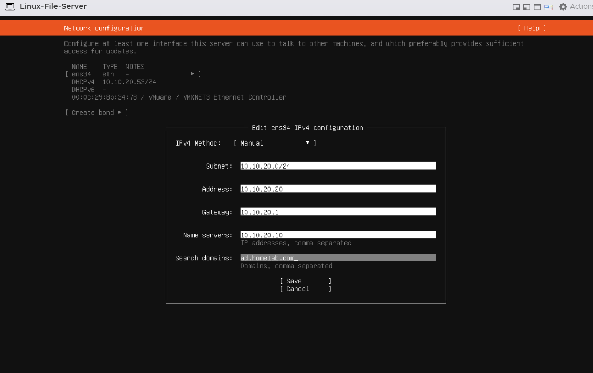
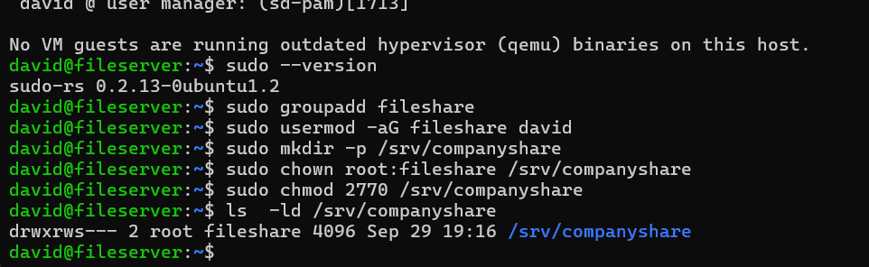
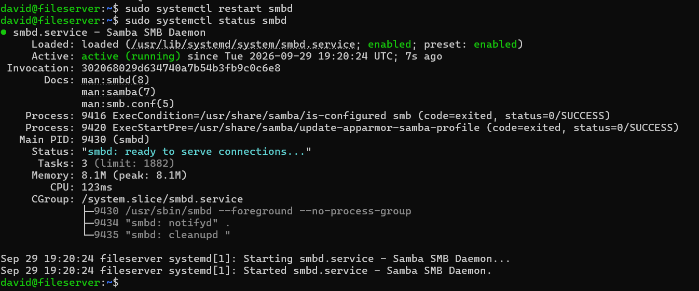
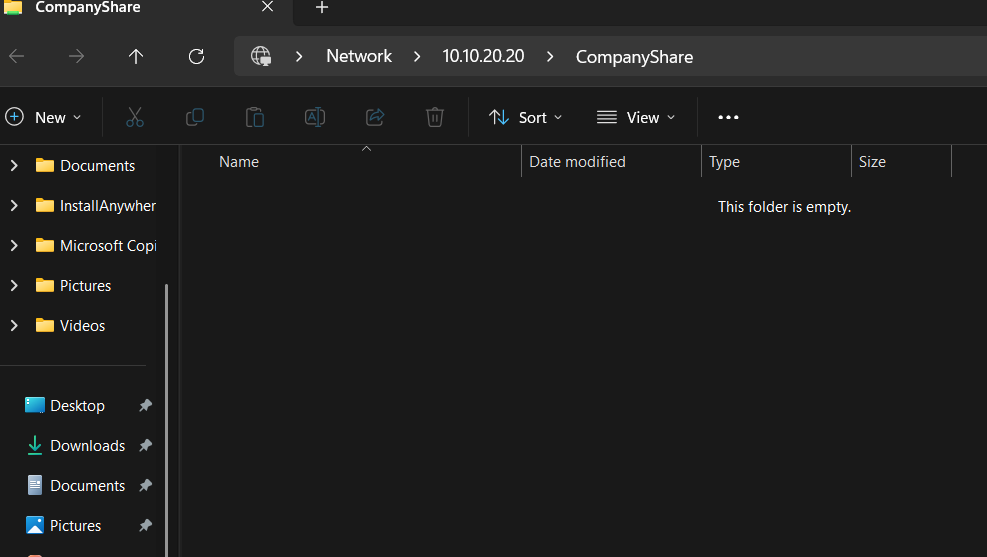

# Linux File Server

## Overview

An Ubuntu Server virtual machine was deployed on VMware ESXi to provide hands-on experience with Linux administration, networking, permissions, SSH, and Samba file sharing.

The server operates on the dedicated **Server VLAN 20** alongside the Windows Server domain controller.

It provides a Samba network share that can be accessed from Windows systems while using Linux users, groups, and filesystem permissions to control access.

---

## Server Configuration

| Setting | Configuration |
|---|---|
| Hostname | `fileserver` |
| Platform | VMware ESXi |
| Network | `Servers-VLAN20` |
| VLAN | 20 |
| IP Address | `10.10.20.20` |
| Subnet | `10.10.20.0/24` |
| Default Gateway | `10.10.20.1` |
| DNS Server | `10.10.20.10` |
| Search Domain | `ad.homelab.com` |
| Primary Services | SSH, Samba |

The server uses a static IP address because it provides network services that need to remain consistently reachable.

---

## Static Network Configuration

The Linux server was configured with:

```text
IP Address:     10.10.20.20
Subnet:         10.10.20.0/24
Default Gateway: 10.10.20.1
DNS Server:     10.10.20.10
Search Domain:  ad.homelab.com
```

### Ubuntu Network Configuration



The default gateway points to the HSRP virtual gateway for VLAN 20.

DNS points to **DC01 (`10.10.20.10`)**, allowing the Linux server to use the Windows DNS infrastructure and resolve resources within the `ad.homelab.com` environment.

---

## SSH Administration

OpenSSH was configured on the Linux server to allow remote command-line administration.

The server can be accessed from another system using:

```bash
ssh david@10.10.20.20
```

This allows Linux administration to be performed remotely without relying on the VMware console.

SSH was used throughout the project for tasks such as:

- Managing files and directories
- Configuring permissions
- Managing Linux users and groups
- Managing Samba
- Checking network configuration
- Checking system services
- Troubleshooting connectivity

---

## Linux Group and Directory Configuration

A Linux group named:

```text
fileshare
```

was created to manage access to the shared directory.

The user `david` was added to this group.

```bash
sudo groupadd fileshare
sudo usermod -aG fileshare david
```

The shared directory was created at:

```text
/srv/companyshare
```

The directory was then assigned to the `fileshare` group:

```bash
sudo mkdir -p /srv/companyshare
sudo chown root:fileshare /srv/companyshare
sudo chmod 2770 /srv/companyshare
```

### Filesystem Permission Configuration



The resulting permissions allow the owner and members of the `fileshare` group to access the directory while preventing access for other users.

The **setgid bit** (`2` in `2770`) is used so new files and directories created inside `/srv/companyshare` inherit the `fileshare` group.

This helps maintain consistent group ownership for shared content.

---

## Samba File Sharing

Samba was configured to make the Linux directory accessible to Windows systems using SMB.

The Samba share is named:

```text
CompanyShare
```

and points to:

```text
/srv/companyshare
```

The share configuration uses the `fileshare` Linux group to control access.

Example configuration:

```ini
[CompanyShare]
   path = /srv/companyshare
   browseable = yes
   read only = no
   valid users = @fileshare
   create mask = 0660
   directory mask = 2770
```

The Linux user was also added to Samba authentication:

```bash
sudo smbpasswd -a david
```

This creates a separation between the underlying Linux filesystem permissions and the authentication used to access the Samba service.

---

## Samba Service Verification

After configuring Samba, the service was restarted:

```bash
sudo systemctl restart smbd
```

The service status was then verified using:

```bash
sudo systemctl status smbd
```

### Samba Service Running



The service reports:

```text
Active: active (running)
```

confirming that the Samba SMB daemon is operational and ready to accept connections.

---

## Windows Access to the Linux Share

The Samba share was tested from a Windows system using:

```text
\\10.10.20.20\CompanyShare
```

### Windows Client Verification



Successful access from Windows verifies several components working together:

```text
Windows Client
      |
      | SMB
      v
Cisco Network
      |
      v
VLAN 20
      |
      v
Linux File Server
10.10.20.20
      |
      v
Samba
      |
      v
/srv/companyshare
```

This confirms that the Linux server is reachable from the Windows environment and that Samba is correctly presenting the Linux filesystem as an SMB network share.

---

## Linux Permissions and Samba Permissions

One of the important concepts practiced during this implementation was the relationship between **Linux filesystem permissions** and **Samba access controls**.

Access to the share depends on multiple layers:

```text
User
  |
  v
Samba Authentication
  |
  v
Samba Share Configuration
  |
  v
Linux User / Group Membership
  |
  v
Linux Filesystem Permissions
  |
  v
/srv/companyshare
```

A Samba user may successfully authenticate but still be unable to modify files if the underlying Linux permissions do not permit the operation.

This provided practical experience troubleshooting permissions across both Linux and SMB.

---

## DNS Integration

The Linux server uses:

```text
10.10.20.10
```

as its DNS server.

This address belongs to **DC01**, which provides DNS services for the lab.

The Linux server was able to resolve:

```text
ad.homelab.com
```

through DC01.

This demonstrates that the Linux environment can use DNS services hosted on Windows Server even though the Linux server itself is not being used as a Windows workstation.

---

## Network Integration

The Linux File Server is connected to the ESXi port group:

```text
Servers-VLAN20
```

which maps the VM to:

```text
VLAN 20
```

Its network path is:

```text
Linux File Server
10.10.20.20
      |
      v
Servers-VLAN20
      |
      v
VMware vSwitch
      |
      v
ESXi Physical NIC
      |
      v
SW2 Gi1/0/13
      |
      v
Physical Cisco Network
```

For communication with systems on other VLANs, traffic is routed through R2/R3.

The VLAN 20 HSRP virtual gateway is:

```text
10.10.20.1
```

This means the Linux server participates in the same routing and switching infrastructure as the rest of the physical homelab.

---

## Validation

The Linux server implementation was validated through:

- Static IPv4 configuration
- Gateway connectivity
- DNS resolution through DC01
- SSH remote access
- Linux user and group configuration
- Filesystem ownership configuration
- Linux permission testing
- Samba configuration
- Samba authentication
- `smbd` service verification
- Windows SMB connectivity
- Access to `CompanyShare`
- Communication through the physical Cisco network

---

## Skills Practiced

This portion of the project provided hands-on experience with:

- Ubuntu Server administration
- Linux command-line administration
- Static network configuration
- Linux users and groups
- File ownership
- Linux filesystem permissions
- setgid directory permissions
- systemd service management
- OpenSSH
- Samba
- SMB file sharing
- Windows/Linux interoperability
- DNS integration
- VLAN-based server networking
- Troubleshooting permissions
- Remote server administration

---

## Key Takeaway

The Linux File Server adds a Linux-based infrastructure component to the homelab and demonstrates interoperability between Linux, Windows, VMware, and Cisco networking.

Rather than running the Linux VM on an isolated virtual network, the server operates on the physical lab's **VLAN 20 server network**, uses the redundant VLAN gateway provided by the Cisco routers, uses DC01 for DNS, and provides an SMB file share that can be accessed from Windows.

This provides practical experience managing a Linux server as part of a larger multi-platform infrastructure environment.
