# Cisco Enterprise Homelab – Network Verification & Testing

This document provides verification evidence collected directly from the physical Cisco routers and switches after the network was configured.

The purpose of this document is to verify routing, redundancy, VLAN segmentation, trunking, EtherChannel, Spanning Tree, and management connectivity across the lab.

---

# 1. R1 – Edge Routing & OSPF

R1 operates as the edge router between the internal lab network and the upstream home network.

## Interface Status

The `show ip interface brief` command verifies the operational state and addressing of R1's primary interfaces.

- `GigabitEthernet0/0` – `10.10.1.1` – Up/Up
- `GigabitEthernet0/1` – `10.0.0.238` – Up/Up
- `Loopback0` – `1.1.1.1` – Up/Up

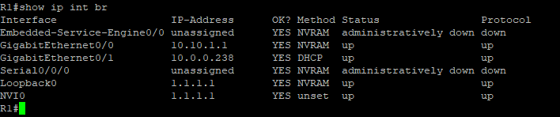

## OSPF Neighbor Verification

The `show ip ospf neighbor` command confirms that R1 has formed FULL OSPF adjacencies with both internal routers.

- R2 Router ID: `2.2.2.2` – FULL/BDR
- R3 Router ID: `3.3.3.3` – FULL/DR

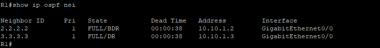

## Routing Table

R1 dynamically learns the internal VLAN networks through OSPF:

- `10.10.10.0/24` – Users
- `10.10.20.0/24` – Servers
- `10.10.99.0/24` – Management

R1 has equal-cost OSPF paths through R2 (`10.10.1.2`) and R3 (`10.10.1.3`).

A static default route points toward the upstream gateway at `10.0.0.1`.

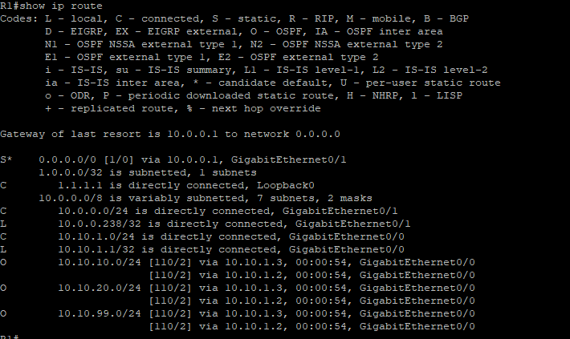

---

# 2. R2 – Router-on-a-Stick, OSPF & HSRP Active

R2 provides inter-VLAN routing through 802.1Q subinterfaces and operates as the preferred HSRP router.

## Interface & Subinterface Status

R2 has operational subinterfaces for the lab VLANs:

- `Gi0/0.10` – `10.10.10.2`
- `Gi0/0.20` – `10.10.20.2`
- `Gi0/0.50` – `10.10.1.2`
- `Gi0/0.99` – `10.10.99.2`
- `Loopback0` – `2.2.2.2`

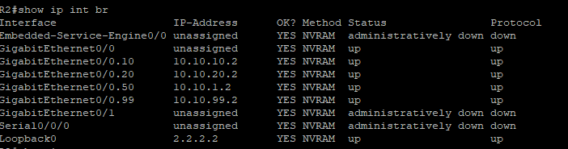

## OSPF Neighbor Verification

R2 maintains FULL OSPF adjacencies with R1 and R3 across VLAN 50.

- R1 (`1.1.1.1`) – FULL/DROTHER
- R3 (`3.3.3.3`) – FULL/DR

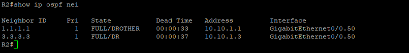

## Routing Verification

R2 receives the default route from R1 through OSPF.

The route appears as an OSPF External Type 2 route:

`O*E2 0.0.0.0/0 via 10.10.1.1`

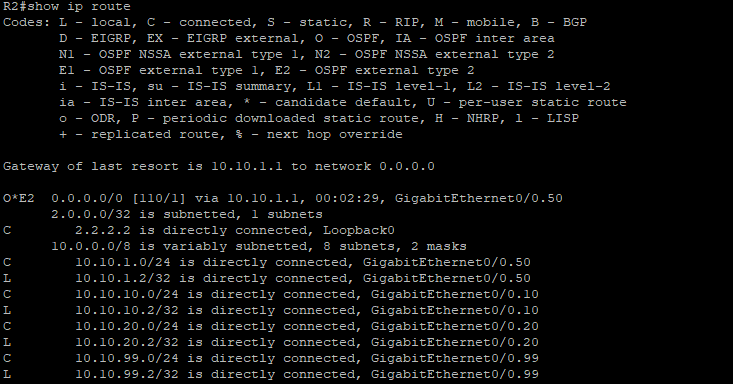

## HSRP Active Router Verification

The `show standby brief` command confirms that R2 is the Active HSRP router for VLANs 10, 20, and 99.

| VLAN | R2 Priority | State | Standby Router | Virtual Gateway |
|---|---:|---|---|---|
| 10 | 105 | Active | 10.10.10.3 | 10.10.10.1 |
| 20 | 105 | Active | 10.10.20.3 | 10.10.20.1 |
| 99 | 105 | Active | 10.10.99.3 | 10.10.99.1 |

Preemption is enabled, allowing R2 to resume the Active role when available.

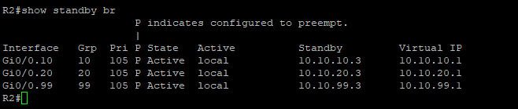

---

# 3. R3 – Router-on-a-Stick, OSPF & HSRP Standby

R3 provides redundant inter-VLAN routing and operates as the HSRP Standby router.

## Interface & Subinterface Status

R3 has operational subinterfaces for the same VLAN infrastructure:

- `Gi0/0.10` – `10.10.10.3`
- `Gi0/0.20` – `10.10.20.3`
- `Gi0/0.50` – `10.10.1.3`
- `Gi0/0.99` – `10.10.99.3`
- `Loopback0` – `3.3.3.3`

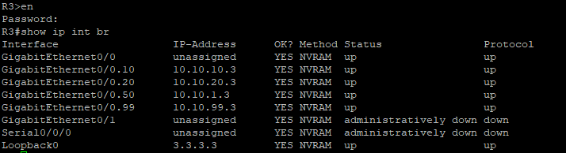

## OSPF Neighbor Verification

R3 maintains FULL OSPF adjacencies with both R1 and R2.

- R1 (`1.1.1.1`) – FULL/DROTHER
- R2 (`2.2.2.2`) – FULL/BDR

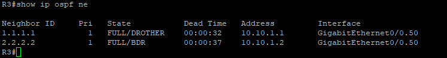

## Routing Verification

R3 receives the default route from R1 through OSPF:

`O*E2 0.0.0.0/0 via 10.10.1.1`

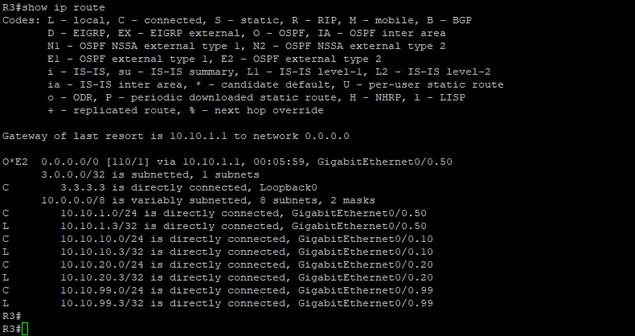

## HSRP Standby Router Verification

R3 operates as the Standby HSRP router for VLANs 10, 20, and 99.

| VLAN | R3 Priority | State | Active Router | Virtual Gateway |
|---|---:|---|---|---|
| 10 | 100 | Standby | 10.10.10.2 | 10.10.10.1 |
| 20 | 100 | Standby | 10.10.20.2 | 10.10.20.1 |
| 99 | 100 | Standby | 10.10.99.2 | 10.10.99.1 |

Preemption is also configured on R3.

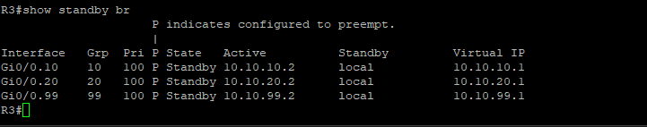

---

# 4. SW1 – Distribution Switching

SW1 operates as the distribution switch and provides VLAN, trunk, EtherChannel, Spanning Tree, and management connectivity.

## Management Interface

The VLAN 99 management SVI is configured as `10.10.99.11` and is operational Up/Up.

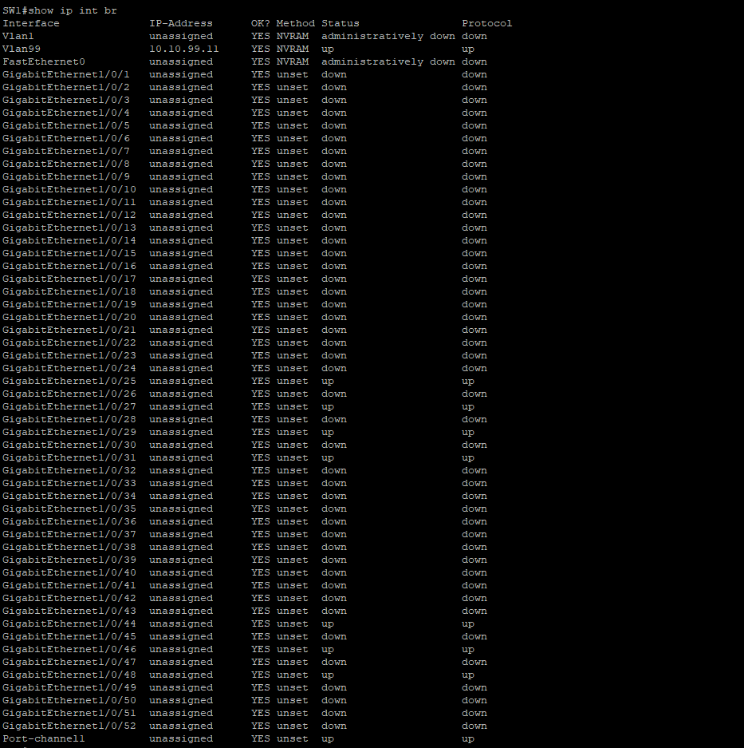

## VLAN Verification

The VLAN database confirms the primary lab VLANs:

| VLAN | Name |
|---|---|
| 10 | Users |
| 20 | Servers |
| 50 | Transit |
| 99 | Management |
| 1000 | Native_C |

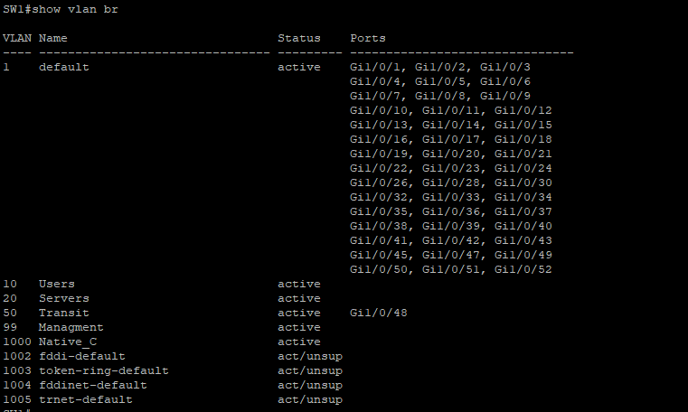

## 802.1Q Trunk Verification

SW1 has operational 802.1Q trunks.

The trunks use VLAN 1000 as the native VLAN and carry VLANs `10,20,50,99`.

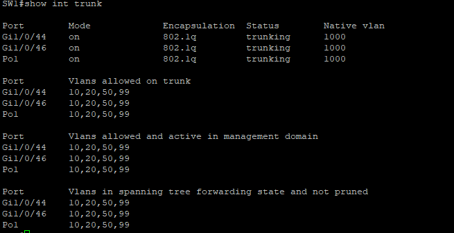

## LACP EtherChannel Verification

SW1 and SW2 are connected using a four-link LACP EtherChannel.

The `show etherchannel summary` output reports:

- `Po1(SU)` – Layer 2 Port-channel in use
- Protocol – LACP
- `Gi1/0/25(P)`
- `Gi1/0/27(P)`
- `Gi1/0/29(P)`
- `Gi1/0/31(P)`

The `(P)` state confirms that all four physical interfaces are successfully bundled into the Port-channel.

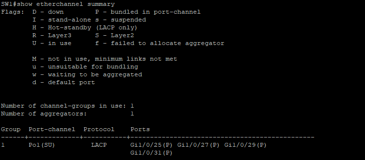

## Spanning Tree Verification

For VLAN 10, SW1 identifies itself as the root bridge.

Port-channel1 and the relevant trunk interfaces are in the forwarding state.

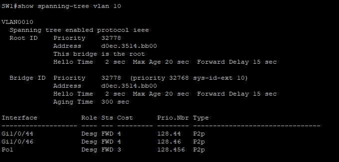

---

# 5. SW2 – Access Switching

SW2 operates as the access switch and connects to SW1 through the four-link LACP EtherChannel.

## Management Interface

The VLAN 99 management SVI is configured as `10.10.99.12` and is Up/Up.

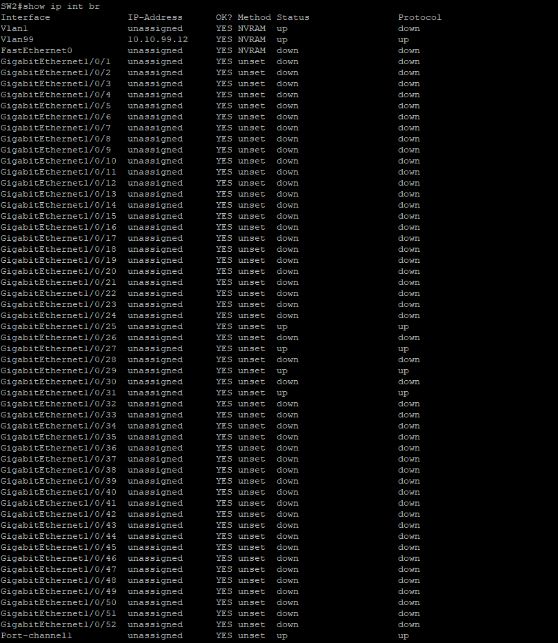

## VLAN & Access Port Verification

SW2 contains the VLAN infrastructure used throughout the lab.

VLAN 10 and VLAN 20 contain access ports for user and server connectivity.

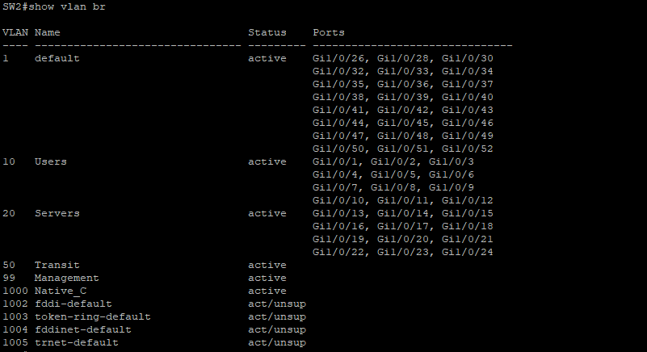

## 802.1Q Trunk Verification

Port-channel1 operates as an 802.1Q trunk between SW2 and SW1.

The trunk:

- Uses VLAN 1000 as the native VLAN
- Allows VLANs 10, 20, 50, and 99
- Shows the VLANs in the Spanning Tree forwarding state

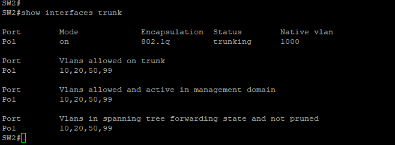

## LACP EtherChannel Verification

SW2 confirms the same four-link LACP bundle:

- `Po1(SU)`
- `Gi1/0/25(P)`
- `Gi1/0/27(P)`
- `Gi1/0/29(P)`
- `Gi1/0/31(P)`

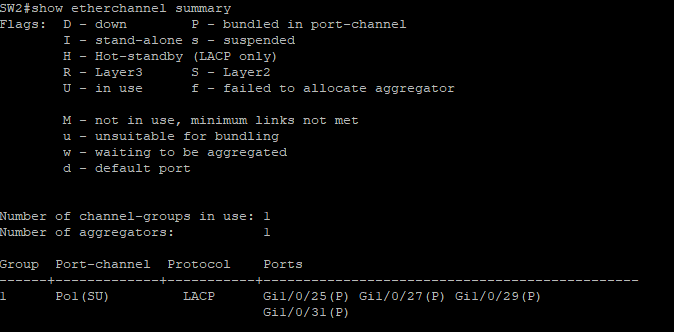

## Spanning Tree Verification

SW2 identifies SW1 as the root bridge for VLAN 10.

Port-channel1 is selected as SW2's root port and is in the forwarding state.

This verifies that the logical EtherChannel is being treated as the Layer 2 path toward the STP root bridge.

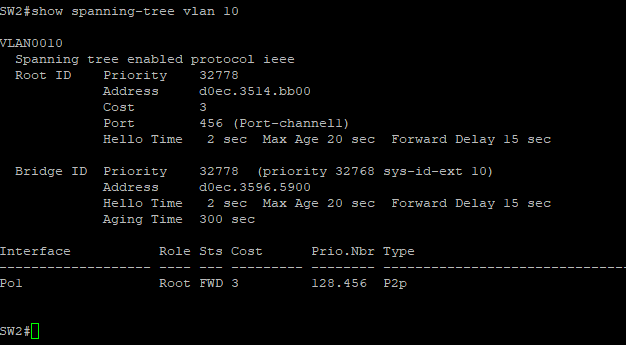

---

# Verification Summary

The collected command outputs verify the operation of the core network infrastructure:

- OSPF adjacencies established between R1, R2, and R3
- Internal networks dynamically advertised through OSPF
- Default route propagated from R1 to R2 and R3
- Router-on-a-stick subinterfaces operational
- HSRP providing redundant default gateways
- R2 operating as HSRP Active
- R3 operating as HSRP Standby
- VLAN segmentation present across both switches
- 802.1Q trunking operational
- Four-link LACP EtherChannel successfully bundled
- Spanning Tree operating with SW1 as the observed root bridge for VLAN 10
- Management SVIs operational on SW1 and SW2

---

# Future Verification

Additional end-device testing will be added as the lab expands.

Planned verification includes:

- DHCP client address assignment
- Default gateway verification
- DNS resolution testing
- Inter-VLAN client connectivity
- Internet connectivity
- NAT/PAT translation verification

These tests will provide additional end-to-end validation from physical client devices through the Cisco network.
