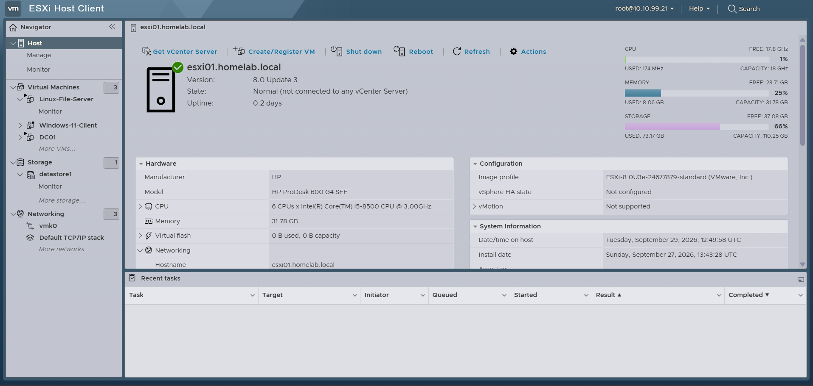
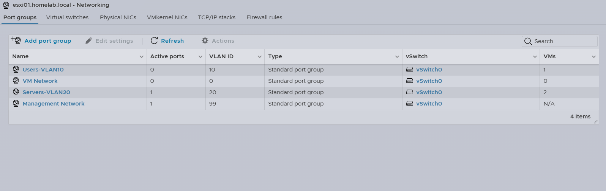
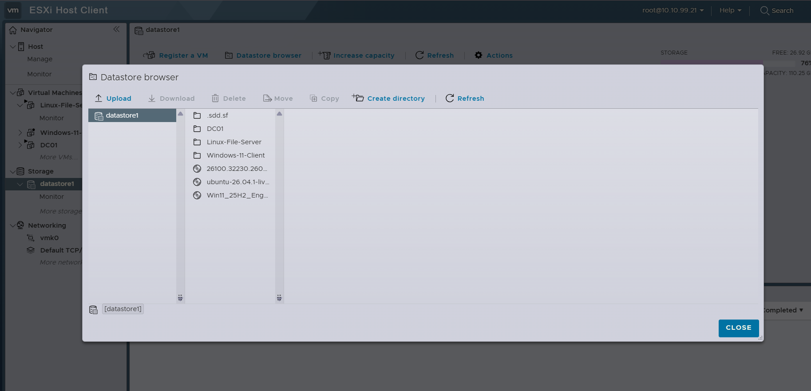

# VMware ESXi & Virtualization

## Overview

VMware ESXi was added to the homelab to integrate virtualization with the existing physical Cisco network.

The ESXi host runs Windows and Linux virtual machines across separate VLANs, allowing the lab to simulate an environment where users, servers, network infrastructure, and management systems are logically segmented while operating on the same physical infrastructure.

---

## Physical ESXi Host

| Component | Configuration |
|---|---|
| Platform | VMware ESXi 8.0 Update 3 |
| Hardware | HP ProDesk 600 G4 SFF |
| Processor | Intel Core i5-8500 |
| Memory | 32 GB RAM |
| Hostname | `esxi01.homelab.local` |
| ESXi Management IP | `10.10.99.21` |
| Management VLAN | VLAN 99 |
| Physical Switch | SW2 |
| Switch Interface | `Gi1/0/13` |

The ESXi management interface is placed on the dedicated Management VLAN 99, separating infrastructure management from normal user and server traffic.

### ESXi Host Dashboard



The ESXi Host Client provides centralized management of the standalone hypervisor, including virtual machines, networking, storage, resource utilization, and host configuration.

---

## Physical Network Integration

The ESXi host is physically connected to **SW2 interface Gi1/0/13**.

This connection extends the VLAN architecture of the physical Cisco network into the virtual environment.

The primary VLANs used by ESXi are:

| VLAN | Purpose |
|---:|---|
| 10 | User/client virtual machines |
| 20 | Server virtual machines |
| 99 | ESXi management |

This allows virtual machines to participate in the physical network while maintaining the same segmentation used throughout the rest of the lab.

---

## ESXi Virtual Networking

Separate ESXi port groups were configured for the different network roles.

| Port Group | VLAN | Purpose |
|---|---:|---|
| `Users-VLAN10` | 10 | User/client virtual machines |
| `Servers-VLAN20` | 20 | Server virtual machines |
| `Management Network` | 99 | ESXi host management |

### Port Group Configuration



The port groups map virtual machines to the appropriate physical VLAN.

For example:

- Windows 11 → `Users-VLAN10`
- DC01 → `Servers-VLAN20`
- Linux File Server → `Servers-VLAN20`
- ESXi Management → VLAN 99

This allows the virtual infrastructure to use the same VLAN segmentation, inter-VLAN routing, and gateway redundancy provided by the Cisco network.

---

## Virtual Machines

Three primary virtual machines are currently deployed on the ESXi host.

| Virtual Machine | Role | VLAN | IP Address |
|---|---|---:|---|
| DC01 | Active Directory / DNS | 20 | `10.10.20.10` |
| Linux File Server | Samba / SSH | 20 | `10.10.20.20` |
| Windows 11 Client | Domain-joined workstation | 10 | DHCP |

### Datastore and VM Files



The ESXi datastore contains the virtual machine files for DC01, the Linux File Server, and the Windows 11 client.

---

## DC01

DC01 is the Windows Server virtual machine responsible for centralized Windows infrastructure services.

| Setting | Configuration |
|---|---|
| Hostname | `DC01` |
| Network | `Servers-VLAN20` |
| VLAN | 20 |
| IP Address | `10.10.20.10` |
| Default Gateway | `10.10.20.1` |
| Domain | `ad.homelab.com` |
| Roles | Active Directory Domain Services and DNS |

DC01 provides centralized authentication and DNS services for the Windows domain.

Detailed Active Directory configuration is documented separately in:

[Active Directory & Windows Server](active-directory.md)

---

## Linux File Server

The Linux server provides Linux administration and network file-sharing experience.

| Setting | Configuration |
|---|---|
| Hostname | `fileserver` |
| Network | `Servers-VLAN20` |
| VLAN | 20 |
| IP Address | `10.10.20.20` |
| Default Gateway | `10.10.20.1` |
| DNS Server | `10.10.20.10` |
| Services | SSH, Samba |

The server uses DC01 for DNS and provides Samba file-sharing services to systems within the lab.

Detailed Linux configuration is documented separately in:

[Linux File Server](linux-file-server.md)

---

## Windows 11 Client

A Windows 11 Pro virtual machine represents a standard enterprise workstation.

| Setting | Configuration |
|---|---|
| Operating System | Windows 11 Pro |
| Network | `Users-VLAN10` |
| VLAN | 10 |
| Addressing | DHCP |
| Default Gateway | `10.10.10.1` |
| DNS Server | `10.10.20.10` |
| Domain | `ad.homelab.com` |

The workstation was joined to the Active Directory domain and is used to test:

- Domain authentication
- DNS resolution
- Group Policy
- Network shares
- DHCP
- Inter-VLAN communication

---

## Physical and Virtual Network Path

Communication between the virtual machines relies on both VMware virtual networking and the physical Cisco infrastructure.

```text
                VMware ESXi
              10.10.99.21
                    |
          +---------+---------+
          |                   |
    Users-VLAN10        Servers-VLAN20
       VLAN 10              VLAN 20
          |                   |
    Windows 11          +-----+------+
                        |            |
                      DC01      Linux Server
                  10.10.20.10   10.10.20.20
          |                   |
          +---------+---------+
                    |
                 vSwitch0
                    |
              Physical NIC
                    |
              SW2 Gi1/0/13
                    |
              Cisco Network
                    |
                 R2 / R3
           Inter-VLAN Routing
                  + HSRP
```

R2 and R3 provide the virtual default gateways:

- VLAN 10 → `10.10.10.1`
- VLAN 20 → `10.10.20.1`
- VLAN 99 → `10.10.99.1`

As a result, communication between virtual machines on different VLANs traverses the physical Cisco network rather than bypassing the network architecture.

---

## Storage Provisioning

Virtual machine disks use **thin provisioning** to make more efficient use of the ESXi datastore.

Thin provisioning allows a virtual disk to have a defined maximum capacity without immediately consuming that entire amount of physical datastore space.

This became an important learning point during the deployment of DC01.

DC01 was initially created with a large thick-provisioned virtual disk, which consumed significantly more datastore capacity than necessary. The VM was rebuilt using thin provisioning so datastore usage could grow as data was actually written.

This provided hands-on experience with:

- Virtual disk capacity
- Datastore utilization
- Thin provisioning
- Thick provisioning
- Storage planning for virtual machines

---

## Snapshot Testing

VMware snapshots were tested using the Linux server.

A snapshot was created before making changes to the virtual machine.

The testing process included:

1. Creating a snapshot.
2. Creating test files and directories inside Linux.
3. Verifying the changes.
4. Reverting the VM to the snapshot.
5. Confirming that changes made after the snapshot disappeared.

This demonstrated how snapshots can provide a temporary rollback point before configuration changes or testing.

Snapshots were treated as temporary recovery points rather than backups.

---

## Resource Monitoring

ESXi performance monitoring was used to observe virtual machine resource utilization.

CPU load was intentionally generated inside the Linux VM and monitored from both the Linux operating system and the ESXi Host Client.

This allowed resource utilization to be compared from two perspectives:

- Guest operating system
- ESXi hypervisor

Linux utilities such as `top` were used alongside ESXi performance monitoring to observe CPU utilization.

---

## Validation

The VMware environment was tested as part of the larger physical network.

Successful testing included:

- ESXi management connectivity on VLAN 99
- VLAN 10 virtual machine connectivity
- VLAN 20 virtual machine connectivity
- DHCP assignment to the Windows 11 client
- Communication between VLAN 10 and VLAN 20
- Connectivity to HSRP default gateways
- Internet connectivity through R1 NAT/PAT
- DNS resolution through DC01
- Active Directory domain authentication
- Group Policy application
- SSH access to the Linux server
- Samba file sharing
- Snapshot creation and restoration
- ESXi resource monitoring

---

## Skills Practiced

This portion of the project provided hands-on experience with:

- VMware ESXi installation and administration
- Type-1 hypervisor management
- Virtual machine deployment
- Virtual switches and port groups
- VLAN tagging in a virtualized environment
- Integration of physical and virtual networking
- Windows Server virtualization
- Linux virtualization
- Thin provisioning
- Datastore management
- VM snapshots
- Resource monitoring
- Cross-VLAN troubleshooting
- Server and client network configuration

---

## Key Takeaway

Adding VMware ESXi expanded the original physical Cisco network into a more complete infrastructure homelab.

The Cisco routers and switches now provide the underlying network for virtualized Windows and Linux systems running services such as Active Directory, DNS, Group Policy, SSH, and Samba.

This provides a single environment for practicing **networking, virtualization, Windows administration, Linux administration, and infrastructure troubleshooting**.
